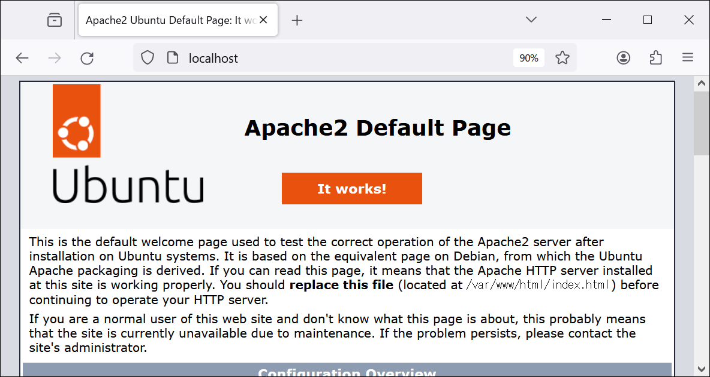
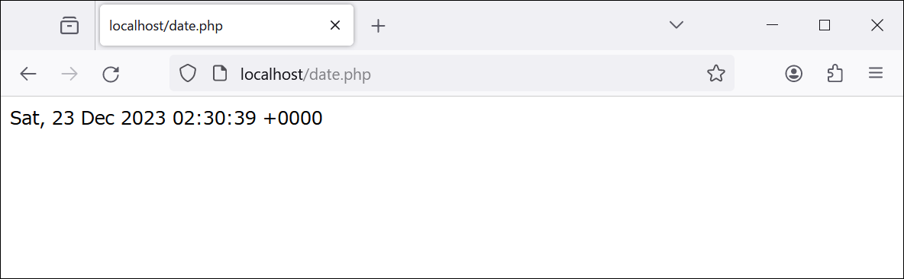
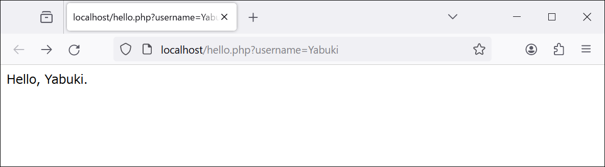
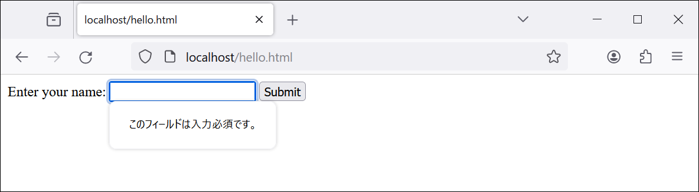
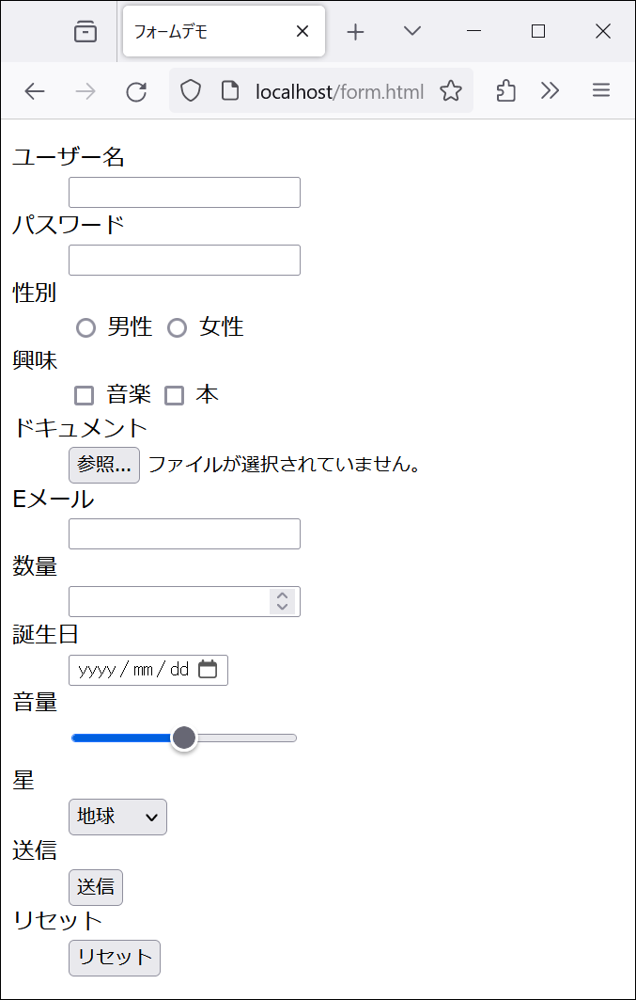
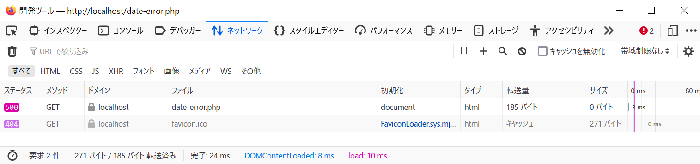
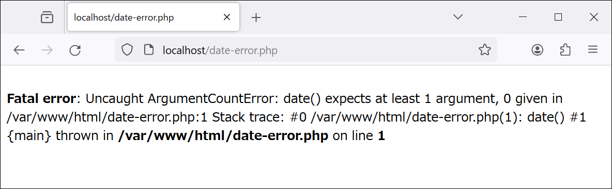

[← 準備](README.md)　[第8章 Webアプリケーションの構築 →](08.md)

# 第7章 Webアプリケーションの基礎

> [!WARNING]
> ここで紹介する例は，概念を説明するための最低限のものである。セキュリティ上の問題（脆弱性）が存在するため，公開された環境でそのまま使うべきではない。また，HTMLは最低限の要素だけを使う場合がある。HTMLの全体を構文エラーの無いものにすることにはこだわらない。

## Webアプリケーションサーバの準備

> [!NOTE]
> Webサーバ（Apache）を起動する。

```bash
apachectl start
```

http://localhost にアクセスして，次のようなページが表示されればよい（Apacheの動作確認）。



## 例1：現在の日時を表示するページ

> [!IMPORTANT]
> Webサーバの現在日時を表示する。

http://localhost/date.php にアクセスすると，次のようなページが生成される。



実装：[date.php](app/html/date.php)の内容は次のとおり。

```php
<?php
echo date("r");
```

このコードについて補足する。

部分|意味
--|--
`<?php`|それ以下がPHPのプログラムであることを示す文字列
`echo`|文字列を出力する命令
`date`|現在の日時を表す関数
`"r"`|その日時の形式を指定する文字列

## 例2：クエリに対応するページ

### クエリを含むURL

> [!IMPORTANT]
> クエリに対応してページを生成する。

http://localhost/hello.php?username=Yabuki にアクセスすると，「Hello, Yabuki.」と表示される。



[hello.php](app/html/hello.php)の内容は次のとおり。上記のURLでアクセスすると，`$_GET['username']`が`Yabuki`に置き換わる。

```php
<?php
echo "Hello, {$_GET['username']}.";
```

### クエリを構成する技術の応用例

> [!IMPORTANT]
> 国立国会図書館サーチを使うためのクエリを構成する。

参考資料

- [API仕様の概要](https://ndlsearch.ndl.go.jp/help/api/specifications)
- [国立国会図書館サーチ 外部提供インタフェース仕様書（第1.2版） 2024.7.12 （PDF）](https://ndlsearch.ndl.go.jp/file/help/api/specifications/ndlsearch_api_20240712.pdf)

OpenSearch検索項目（仕様書の表4-1の抜粋）

|参照名|内容                                                               |
|--|--|
|title|タイトル|
|creator|作成者|
|publisher|出版者|
|ndc|分類（NDC, NDLC）|
|from|開始出版年月日|
|until|終了出版年月日|
|cnt|出力レコード上限数|
|idx|レコード取得開始位置|
|isbn|ISBN|

検索の例（タイトルに「web」，出版社に「放送」を含むもの）：https://ndlsearch.ndl.go.jp/api/opensearch?title=web&publisher=放送

### フォーム

> [!IMPORTANT]
> フォームを使ってクエリを構成する。

http://localhost/hello.html にアクセスすると，次のようなフォームが表示される。



「Yabuki」と入力して「Submit」ボタンを押すと，http://localhost/hello.php?username=Yabuki というURLが作れら，リクエストが実行される。

[hello.html](app/html/hello.html)の内容は次のとおり。`required`によって，テキストボックスへの入力が必須になる。

```html
<form action="hello.php" method="get">
  <label for="username">Enter your name:</label>
  <input type="text" id="username" name="username" required>
  <input type="submit" value="Submit">
</form>
```

http://localhost/form.html にアクセスすると，次のようなフォームが表示される。このように，フォームにはテキストボックス以外にもさまざまな部品がある（[form.html](app/html/form.html)を参照）。



## URLリライト

> [!IMPORTANT]
> プログラムの実行前に，URLを変換する。

Apacheの設定ファイル/etc/apache2/sites-available/000-default.confの`<VirtualHost \*:80>`と`</VirtualHost>`の間に，URLリライトのための設定を追加し，URLリライト機能を`a2enmod`で有効にして，Apacheを再起動する。

```bash
sed -i '/<VirtualHost \*:80>/a \
    RewriteEngine On\
    RewriteRule ^/X/(.+)$ /X-$1.html [L] \
    RewriteRule ^/username/([^/]+)/?$ /hello.php?username=$1 [L]' \
/etc/apache2/sites-available/000-default.conf

a2enmod rewrite
apachectl restart
```

次のURLでのアクセス結果は同じになる。

- http://localhost/X/A （X/Aというファイルは無い。）
- http://localhost/X-A.html

次のURLでのアクセス結果は同じになる。

- http://localhost/username/Yabuki （username/Yabukiというファイルは無い。）
- http://localhost/hello.php?username=Yabuki

## 開発のヒント（エラーの確認）

> [!IMPORTANT]
> エラーの確認方法を紹介する。

[date-error.php](app/html/date-error.php)の内容は次のとおり（このコードにはバグがある）。

```php
<?php
echo date();
```

http://localhost/date-error.php にアクセスしてこのコードを実行しようとするとエラーが発生する。この段階では，ブラウザには何も表示されないが，F12やCtrl+Shift+Iで起動する，Firefoxの**ウェブ開発ツール**，Chromeの**デベロッパーツール**等を開いた状態で，ページをリロードし，ネットワークの状況を確認すると，**ステータスコード**が**500**，つまりInternal Server Errorが発生していることがわかる。



Apacheのエラーログ/var/log/apache2/error.logを確認する。

```bash
tail /var/log/apache2/error.log # エラーログの最後の10行を表示する。
```

内容の例を次に示す。

```
[Mon Jul 29 12:03:22.256094 2024] [php:error] [pid 9618] [client 172.17.0.1:42632] PHP Fatal error:  Uncaught ArgumentCountError: date() expects at least 1 argument, 0 given in /var/www/html/date-error.php:2\nStack trace:\n#0 /var/www/html/date-error.php(2): date()\n#1 {main}\n  thrown in /var/www/html/date-error.php on line 2
```

Webブラウザ上でエラーを確認できるように，PHPの設定ファイル/etc/php/バージョン番号/apache2/php.ini で，`display_errors = On`とし，Apacheを再起動する。

```bash
sed -i 's/^display_errors = .*/display_errors = On/' /etc/php/8.3/apache2/php.ini
apachectl restart
```

もう一度http://localhost/date-error.php にアクセスすると，今度はWebブラウザにエラーメッセージが表示される（ステータスコードは**200**になる）。



> [!TIP]
> 設定を変更せずに，コードに`ini_set('display_errors', 1);`を追加しても，同じ結果になる。

> [!CAUTION]
> エラーメッセージを表示するのは開発中だけである。公開された環境では，エラーメッセージを表示すべきではない。

[← 準備](README.md)　[第8章 Webアプリケーションの構築 →](08.md)
