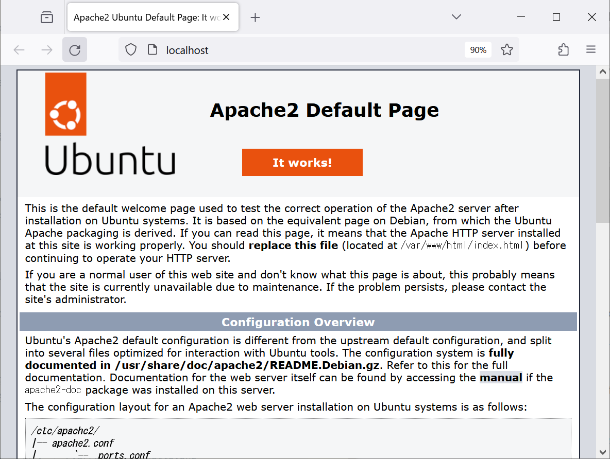
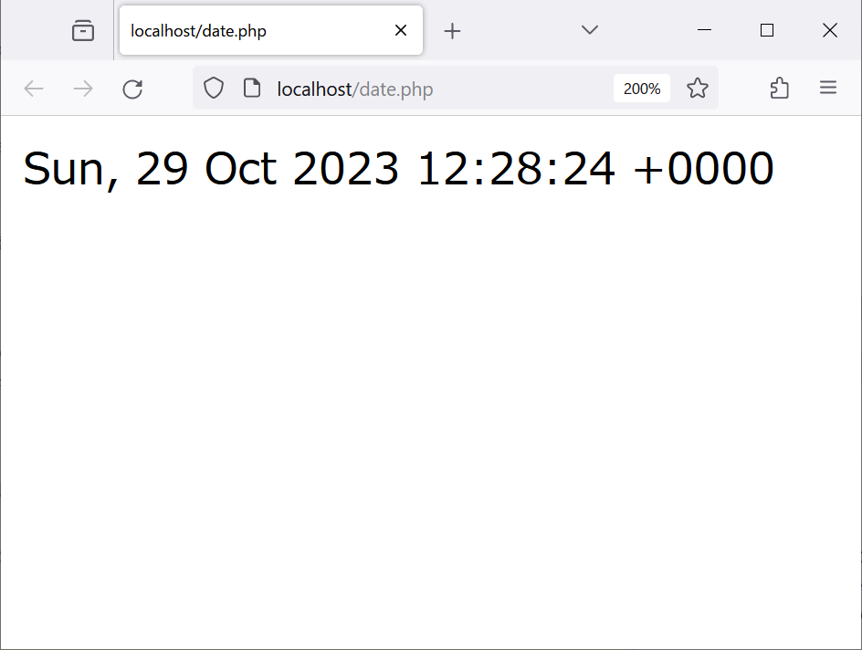
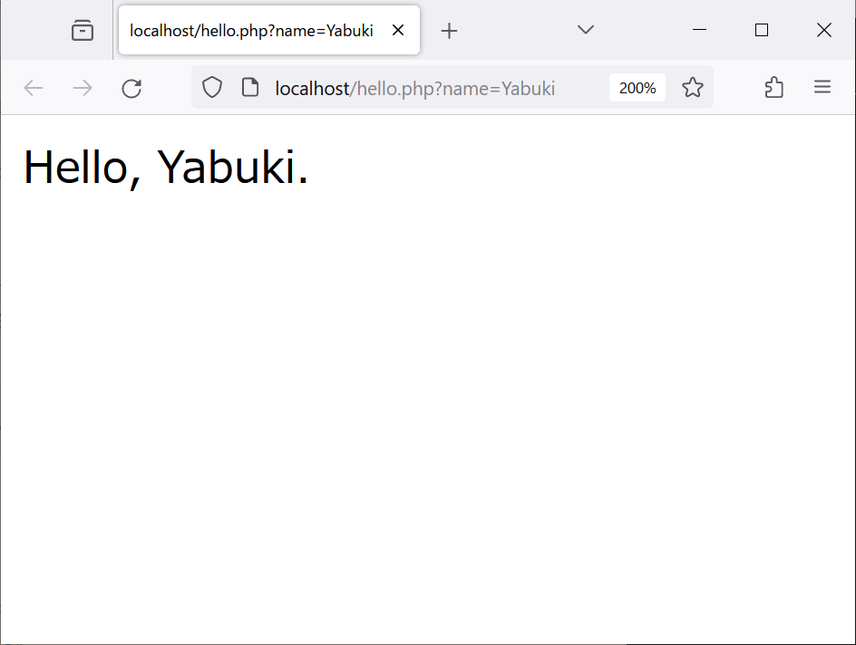
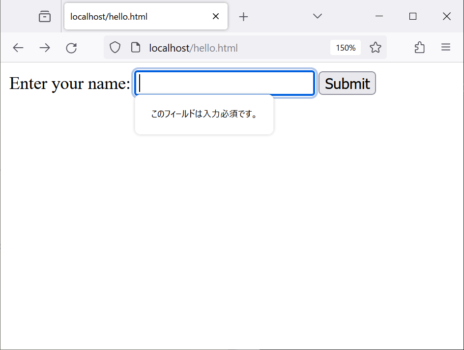
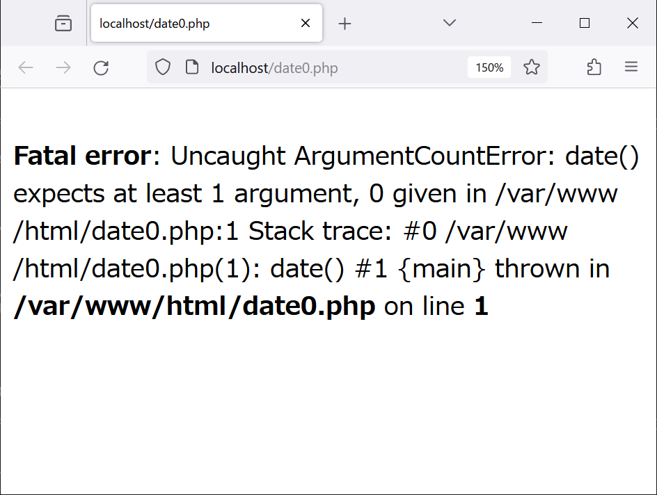

# 第7章 Webアプリケーション入門

> [!CAUTION]
> ここで紹介する例は，概念を説明するための最低限のものである。セキュリティ上の問題（脆弱性）が存在するため，公開された環境でそのまま使うべきではない。また，HTMLは最低限の要素だけを使う場合がある。HTMLの全体を構文エラーの無いものにすることにはこだわらない。

<!-- vscode-markdown-toc -->
* [Webアプリケーションサーバの準備](#Web)
	* [サンプルファイルの準備](#)
* [例1：現在時刻を表示するページ](#1)
* [例2：クエリに対応するページ](#2)
	* [クエリを含むURL](#URL)
	* [フォーム](#-1)
* [URLリライト](#URL-1)
* [開発のヒント（エラーの確認）](#-1)

<!-- vscode-markdown-toc-config
	numbering=false
	autoSave=true
	/vscode-markdown-toc-config -->
<!-- /vscode-markdown-toc -->

## <a name='Web'></a>Webアプリケーションサーバの準備

> [!IMPORTANT]
> 必要なソフトウェア（Apache，PHP等）をインストールし，Apacheを起動する。

```bash
export DEBIAN_FRONTEND=noninteractive # デフォルトの設定でインストールする。
apt update && apt install -y apache2 build-essential curl git libapache2-mod-php php python3 # 必要なソフトウェアをインストールする。
apachectl start # Apacheを起動する。
```

http://localhost にアクセスして，次のようなページが表示されればよい（Apacheの動作確認）。



### <a name=''></a>サンプルファイルの準備

> [!IMPORTANT]
> [07-09/app/html](07-09/app/html) のファイルをApacheのドキュメントルートにコピーする。

```bash
cp /root/host/techappweb/07-09/app/html/* /var/www/html/
```

## <a name='1'></a>例1：現在時刻を表示するページ

http://localhost/date.php にアクセスすると，このコードが実行され，次のようなページが生成される。



[date.php](app/html/date.php)の内容は次のとおり。

```php
<?php echo date("r");
```

このコードについて補足する。

部分|意味
--|--
`<?php`|それ以下がPHPのプログラムであることを示す文字列
`echo`|文字列を出力する命令
`date`|現在の日時を表す関数
`"r"`|その日時の形式を指定する文字列

## <a name='2'></a>例2：クエリに対応するページ

### <a name='URL'></a>クエリを含むURL

http://localhost/hello.php?name=Yabuki にアクセスすると，「Hello, Yabuki.」と表示される。



[hello.php](app/html/hello.php)の内容は次のとおり。

```php
<?php echo "Hello, {$_GET['name']}.\n";
```

### <a name='-1'></a>フォーム

http://localhost/hello.html にアクセスすると，次のようなフォームが表示される。



「Yabuki」と入力して「Submit」ボタンを押すと，http://localhost/hello.php?name=Yabuki というURLが作れら，リクエストが実行される。

[hello.html](app/html/hello.html)の内容は次のとおり。

```html
<form action="hello.php" method="get">
  <label for="name">Enter your name:</label>
  <input type="text" id="name" name="name" required>
  <input type="submit" value="Submit">
</form>
```

http://localhost/form.html にアクセスすると，次のようなフォームが表示される。


このように，フォームにはテキストボックス以外にもさまざまな部品がある（[form.html](app/html/form.html)を参照）。

## <a name='URL-1'></a>URLリライト

Apacheの設定ファイル/etc/apache2/sites-available/000-default.confの`<VirtualHost \*:80>`と`</VirtualHost>`の間に，URLリライトのための設定を追加し，URLリライト機能を有効にして，Apacheを再起動する。

```bash
sed -i '/<VirtualHost \*:80>/a \
    RewriteEngine On\
    RewriteRule ^/name/([^/]+)/?$ /hello.php?name=$1 [L]' \
/etc/apache2/sites-available/000-default.conf

a2enmod rewrite   # URLリライト機能を有効にする。
apachectl restart # Apacheを再起動する。
```

http://localhost/name/Yabuki にアクセスすると，http://localhost/hello.php?name=Yabuki と同じページが表示される。

## <a name='-1'></a>開発のヒント（エラーの確認）

[date-error.php](app/html/date-error.php)の内容は次のとおり（このコードにはバグがある）。

```php
<?php echo date();
```

http://localhost/date-error.php にアクセスしてこのコードを実行しようとするとエラーが発生する。この段階では，ブラウザには何も表示されないが，Firefoxの**ウェブ開発ツール**，Chromeの**デベロッパーツール**等でネットワークの状況を確認すると，ステータスコードが500，つまりInternal Server Errorが発生していることがわかる。

図

Apacheのエラーログ/var/log/apache2/error.logを確認する（結果は割愛）。

```bash
tail /var/log/apache2/error.log # エラーログの最後の10行を表示する。
```

Webブラウザ上でエラーを確認できるように，PHPの設定ファイル/etc/php/バージョン番号/apache2/php.ini で，`display_errors = On`とし，Apacheを再起動する。

```bash
sed -i 's/^display_errors = .*/display_errors = On/' /etc/php/8.1/apache2/php.ini
apachectl restart # Apacheを再起動する。
```

もう一度http://localhost/date-error.php にアクセスすると，今度はWebブラウザにエラーメッセージが表示される。



> [!CAUTION]
> エラーメッセージを表示するのは開発中だけである。公開された環境では，エラーメッセージを表示すべきではない。
