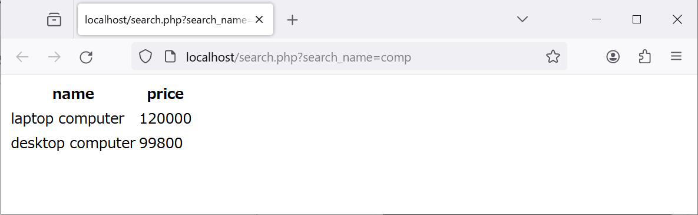
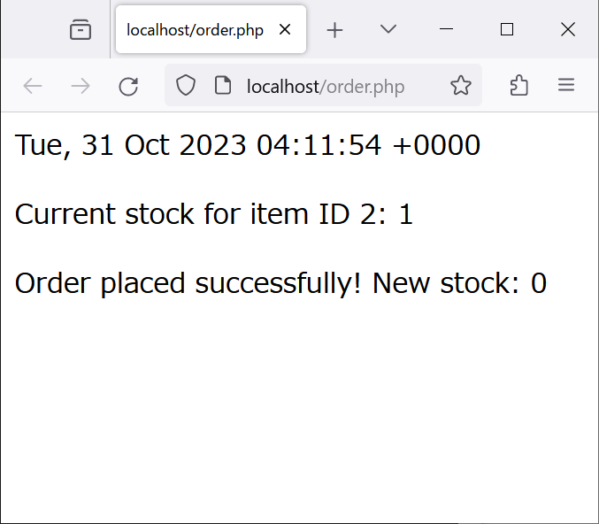
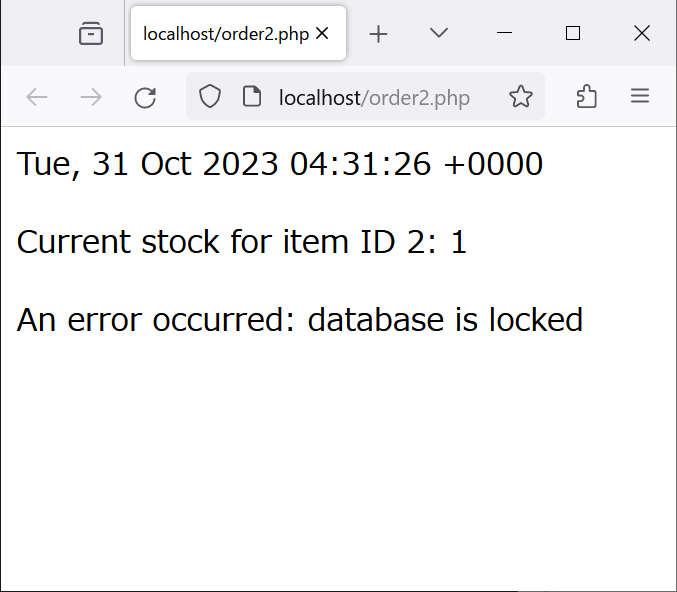
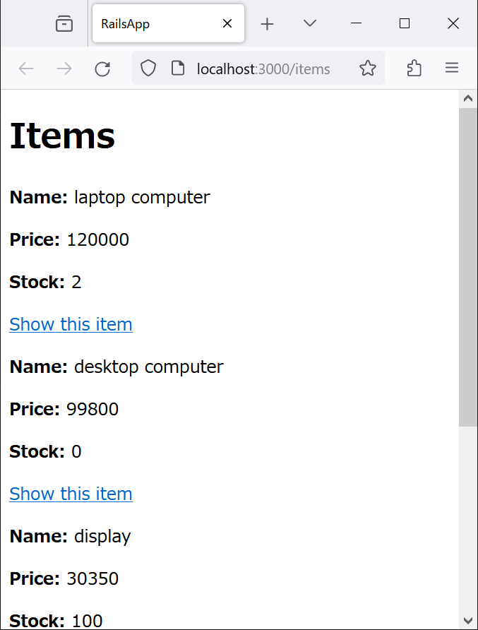
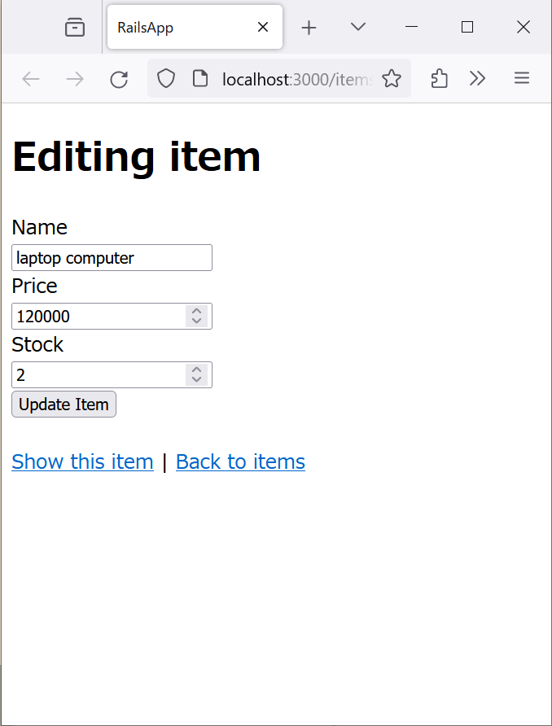
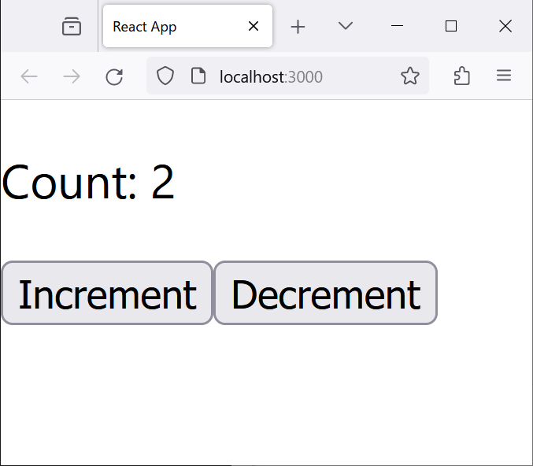

# Webアプリケーションの構築

> [!CAUTION]
> ここで紹介する例は，概念を説明するための最低限のものである。セキュリティ上の問題（脆弱性）が存在するため，公開された環境でそのまま使うべきではない。また，HTMLは最低限の要素だけを使う場合がある。HTMLの全体を構文エラーの無いものにすることにはこだわらない。

<!-- vscode-markdown-toc -->
* [データベース](#)
	* [SQL](#SQL)
	* [Webアプリケーションでのデータベース利用](#Web)
	* [トランザクション](#-1)
		* [失敗例](#-1)
		* [成功例](#-1)
* [クライアントサイドの技術（JavaScript）](#JavaScript)
	* [JavaScriptによる時刻の表示](#JavaScript-1)
	* [JavaScriptによる時刻の表示（自動更新）](#JavaScript-1)
	* [JavaScriptの通信による時刻の取得](#JavaScript-1)
	* [JavaScriptの通信による時刻の取得（自動更新）](#JavaScript-1)
* [フレームワーク](#-1)
	* [サーバーサイドのフレームワーク](#-1)
	* [クライアントサイドのフレームワーク](#-1)

<!-- vscode-markdown-toc-config
	numbering=false
	autoSave=true
	/vscode-markdown-toc-config -->
<!-- /vscode-markdown-toc -->


第7章で構築した環境に，RDBMS（SQLite），サーバサイドのフレームワーク（Ruby on Rails），クライアントサイドのフレームワーク（React）を導入する。

> [!IMPORTANT]
> 第7章で構築したコンテナを，この章のための実験環境として使う。

## <a name=''></a>データベース

> [!IMPORTANT]
> SQLiteをインストールして，Apacheを再起動する。

```bash
apt update && apt install -y php-sqlite3 sqlite3
apachectl restart # Apacheを再起動する。
```

### <a name='SQL'></a>SQL

> [!TIP]
> 以下で実行するSQLは[mydb.sql](mydb.sql)にまとめてある。それを使う場合は，<br>`sqlite3 /var/data/mydb.db < /root/host/techappweb/07-09/mydb.sql`

次のようなテーブルを作成する。

id|name|price|stock
--|--|--|--
1|laptop computer|120000|2
2|desktop computer|99800|0
3|display|30350|100
4|keyboard|2980|10

データベースのためのファイルを格納するフォルダを作り，SQLiteに接続する。

```bash
mkdir /var/data
sqlite3 /var/data/mydb.db
```

以下は，SQLiteのプロンプトで実行する。

```sql
DROP TABLE IF EXISTS items;
CREATE TABLE items (
  id INTEGER PRIMARY KEY AUTOINCREMENT,
  name TEXT,
  price INTEGER,
  stock INTEGER
);
```

**Create**の例として，表のデータを生成する。

```sql
INSERT INTO items (name, price, stock) VALUES
('laptop computer', 120000, 2),
('desktop computer', 99800, 0),
('display', 30350, 100),
('keyboard', 2980, 10);
```

**Read**の例として，テーブルitemsから，在庫数が1より多い商品の，idとnameを取得する。

```sql
SELECT id,name FROM items WHERE stock>1;
```

**Update**の例として，テーブルitemsの，id=2であるデータの，stockを1にする。

```sql
UPDATE items SET stock=1 WHERE id=2;
```

**Delete**の例として，テーブルitemsの，id=4であるデータを削除する。

```sql
DELETE FROM items WHERE id=4;
```

以上の操作をすべて行うと，テーブルitemsは次のようになる。

id|name|price|stock
--|--|--|--
1|laptop computer|120000|2
2|desktop computer|99800|1
3|display|30350|100

この結果を確認する。

```sql
SELECT * FROM items;
```

### <a name='Web'></a>Webアプリケーションでのデータベース利用

SQLiteのデータベースにWebサーバがアクセスできるようにする。

```bash
chown www-data:www-data /var/data /var/data/mydb.db
```

http://localhost/search.php?search_name=comp にアクセスすると，図のようなページが表示される（search_nameの値つまりcompを検索した結果）。



[search.php](app/html/search.php)の内容は次のとおり。

```php
<?php
$db = new PDO('sqlite:/var/data/mydb.db');
$foo = $_GET['search_name'];
$query = "SELECT * FROM items WHERE name LIKE '%{$foo}%'";
$stmt = $db->prepare($query);
$stmt->execute();
$results = $stmt->fetchAll(PDO::FETCH_ASSOC);

if ($results) {
  echo '<table><tr><th>name</th><th>price</th></tr>';
  foreach ($results as $item) {
    echo '<tr>';
    echo "<td>{$item['name']}</td>";
    echo "<td>{$item['price']}</td>";
    echo '</tr>';
  }
  echo '</table>';
} else {
  echo "Not found.";
}
```

### <a name='-1'></a>トランザクション

#### <a name='-1'></a>失敗例

> [!NOTE]
> 在庫数が1個の商品を，二人の顧客が同時に買おうとする。

1. idが2の商品の在庫数を1にする。

```
sqlite3 /var/data/mydb.db 'update items set stock=1 where id=2'
```

2. （1人目の客）Webブラウザからhttp://localhost/order.php にアクセスして購買処理を行う。
3. （2人目の客）次のコマンドを実行して，cURLで購買処理を行う。

```bash
curl http://localhost/order.php
```

在庫数が1にもかかわらず，二人の購買処理は正常終了してしまう。
1人目の実行結果は図のようになる。2人目のコンソールにも同じ内容が表示される。



[order.php](app/html/order.php)の内容は次のとおり。

```php
<?php
echo date("r");
$db = new SQLite3("/var/data/mydb.db");
$stock = $db->querySingle("SELECT stock FROM items WHERE id = 2");

if ($stock >= 1) {
  echo "\n<p>Current stock for item ID 2: {$stock}</p>\n";
  sleep(10); # 10秒待つ
  $newStock = $stock - 1;
  $db->exec("UPDATE items SET stock = $newStock WHERE id = 2");
  echo "<p>Order placed successfully! New stock: {$newStock}</p>\n";
} else {
  echo "<p>Not enough stock.</p>\n";
}
```

#### <a name='-1'></a>成功例

1. idが2の商品の在庫数を1にする。

```
sqlite3 /var/data/mydb.db 'update items set stock=1 where id=2'
```

2. （1人目の客）Webブラウザからhttp://localhost/order-safe.php にアクセスして購買処理を行う。
3. （2人目の客）次のコマンドを実行して，cURLで購買処理を行う。

```bash
curl http://localhost/order-safe.php
```

トランザクションが有効なため，二人の購買処理のうち一人はエラーになる。この場合は，1人目が図のようなエラーになる。



問題を解決するための**トランザクション**を導入した，[order-safe.php](app/html/order-safe.php)の内容は次のとおり。

```
<?php
echo date("r");
$db = new SQLite3("/var/data/mydb.db");
$db->enableExceptions(true);
try {
  $db->exec("BEGIN");
  $stock = $db->querySingle("SELECT stock FROM items WHERE id = 2");
  if ($stock >= 1) {
    echo "\n<p>Current stock for item ID 2: {$stock}</p>\n";
    sleep(10);
    $newStock = $stock - 1;
    $db->exec("UPDATE items SET stock = {$newStock} WHERE id = 2");
    $db->exec("COMMIT");
    echo "<p>Order placed successfully! New stock: $newStock</p>\n";
  } else {
    $db->exec("ROLLBACK");
    echo "<p>Not enough stock.</p>\n";
  }
} catch (Exception $e) {
  $db->exec("ROLLBACK");
  echo "<p>An error occurred: " . $e->getMessage() . "</p>\n";
}
```

## <a name='JavaScript'></a>クライアントサイドの技術（JavaScript）

### <a name='JavaScript-1'></a>JavaScriptによる時刻の表示

http://localhost/date-client1.html にアクセスすると，次のように現在の日時が表示される。

```
Fri Dec 22 2023 15:42:47 GMT+0900 (日本標準時)
```

> [!NOTE]
> 表示を更新するためにはページの再読込が必要である。

[date-client1.html](app/html/date-client1.html)の内容は次のとおり。

```html
<!DOCTYPE html>
<html lang="ja">
<head>
    <title>Date and Time</title>
</head>
<body>
    <div id="result"></div>
    <script>
        var currentDateTime = new Date(); // 現在の日時を取得
        var result = document.getElementById('result'); // 要素の取得
        result.textContent = currentDateTime.toString(); // 内容の更新
    </script>
</body>
</html>
```

### <a name='JavaScript-1'></a>JavaScriptによる時刻の表示（自動更新）

http://localhost/date-client2.html にアクセスすると，次のように現在の日時が表示され，1秒ごとに更新される。

```
Fri Dec 22 2023 15:42:47 GMT+0900 (日本標準時)
```

> [!NOTE]
> 表示を更新するのにページの再読込は必要ない。ページ自体は再読込されず，内容だけが更新される。

[date-client2.html](app/html/date-client2.html)の内容は次のとおり。

```html
<!DOCTYPE html>
<html lang="ja">
  <head>
    <title>Date and Time</title>
  </head>
  <body>
    <div id="result"></div>
    <script>
      var result = document.getElementById("result"); // 要素の取得

      function updateDateTime() {
        var currentDateTime = new Date(); // 現在の日時を取得
        result.textContent = currentDateTime.toString(); // 内容の更新
      }

      setInterval(updateDateTime, 1000); // 1秒ごとにupdateDateTime関数を呼び出す
      updateDateTime(); // 初回の呼び出し
    </script>
  </body>
</html>
```

### <a name='JavaScript-1'></a>JavaScriptの通信による時刻の取得

http://localhost/date-server1.html にアクセスすると，次のように現在の日時が表示される。

```
Fri, 22 Dec 2023 06:51:14 +0000
```

> [!NOTE]
> 表示を更新するためにはページの再読込が必要である。

[date-server1.html](app/html/date-server1.html)の内容は次のとおり。

```html
<!DOCTYPE html>
<html lang="ja">
  <head>
    <title>Date and Time 1</title>
    <script>
      async function fetchData() {
        const response = await fetch('http://localhost/date.php');
        const data = await response.text();
        document.getElementById('result').textContent = data;
      }

      window.onload = fetchData;
    </script>
  </head>
  <body>
    <div id="result"></div>
  </body>
</html>
```

### <a name='JavaScript-1'></a>JavaScriptの通信による時刻の取得（自動更新）

http://localhost/date-server2.html にアクセスすると，次のように現在の日時が表示され，1秒ごとに更新される。

```
Fri, 22 Dec 2023 06:51:14 +0000
```

> [!NOTE]
> 表示を更新するのにページの再読込は必要ない。ページ自体は再読込されず，内容だけが更新される。

[date-server2.html](app/html/date-server2.html)の内容は次のとおり。

```
<!DOCTYPE html>
<html lang="ja">
  <head>
    <title>Date and Time 2</title>
    <script>
      async function fetchData() {
        const response = await fetch('http://localhost/date.php');
        const data = await response.text();
        document.getElementById('result').textContent = data;
      }

      window.onload = function() {
        fetchData();
        setInterval(fetchData, 1000);
      };
    </script>
  </head>
  <body>
    <div id="result"></div>
  </body>
</html>
```

## <a name='-1'></a>フレームワーク

### <a name='-1'></a>サーバーサイドのフレームワーク

**Ruby on Rails**を導入し，表のような商品情報を管理するウェブアプリを構築する。

id|name|price|stock
--|--|--|--
1|laptop computer|120000|2
2|desktop computer|99800|0
3|display|30350|100
4|keyboard|2980|10

まず，必要なフォフトウェアをインストールする。（参考：[Node.jsのInstallation Instructions](https://github.com/nodesource/distributions#ubuntu-versions)）

```bash
curl -fsSL https://deb.nodesource.com/gpgkey/nodesource-repo.gpg.key | gpg --dearmor -o /etc/apt/keyrings/nodesource.gpg
export NODE_MAJOR=21
echo "deb [signed-by=/etc/apt/keyrings/nodesource.gpg] https://deb.nodesource.com/node_$NODE_MAJOR.x nodistro main" | tee /etc/apt/sources.list.d/nodesource.list

export DEBIAN_FRONTEND=noninteractive
apt update && apt install -y libsqlite3-dev libyaml-dev nodejs ruby ruby-dev tzdata && gem install rails -v 7.1.1 && npm install -g yarn
```

Ruby on Railsのウェブアプリを作成する。

```bash
cd
rails new rails-app

cd rails-app
rails generate scaffold Item name:string price:integer stock:integer
rails db:migrate
```

表のデータを生成する。

```bash
cat << 'EOF' >> db/seeds.rb
Item.create!(name: 'laptop computer', price: 120000, stock: 2)
Item.create!(name: 'desktop computer', price: 99800, stock: 0)
Item.create!(name: 'display', price: 30350, stock: 100)
Item.create!(name: 'keyboard', price: 2980, stock: 10)
EOF

rails db:seed
echo 'select * from items' | rails db
```

テスト用のウェブサーバを起動する。

```bash
rails server -b 0.0.0.0
```

http://localhost:3000/items にアクセスすると，次のようなページが表示される。



CRUDが実装されていることを確認する（図は編集ページの例）。



テスト用のウェブサーバをCtrl-Cで停止する。

MVCの実装の詳細を，「cat ファイル名」で確認する。この段階で確認するとよいのは，次のファイルである。

ファイル|内容|備考
--|--|--
app/models/item.rb|商品（item）のモデル|モデルはアプリを作成したときの指示どおりのため，ファイルにはほとんど何も書かれない。
app/views/items/index.html.erb|商品の一覧を表示するビュー|各商品の詳細ページへのリンクや，商品の新規登録のためのリンクを生成する。
app/views/items/show.html.erb|商品の詳細を表示するビュー|商品の編集や削除のためのリンクを生成する。
app/views/items/_form.html.erb|商品の編集フォームを表示するビュー|商品の新規登録フォームも，このファイルを利用する。
app/controllers/items_controller.rb|商品のコントローラ|商品の一覧，詳細，編集，削除のためのメソッドを定義している。

### <a name='-1'></a>クライアントサイドのフレームワーク

**React**のウェブアプリを構築する。このウェブアプリは，カウンターとそれを増減させるボタンからなる。



```bash
cd
CI=true npx create-react-app react-app
cd react-app
```

カウンターとボタンは別々の**コンポーネント**とする。そうすることで，別々に開発でき，別々に再利用できるようになる。

カウンターを実装する。

```bash
cat << 'EOF' > src/Counter.js
import React from 'react';

function Counter({ count }) {
  return <p>Count: {count}</p>;
}

export default Counter;
EOF
```

ボタンを実装する。

```bash
cat << 'EOF' > src/Button.js
import React from 'react';

function Button({ onClick, children }) {
  return <button onClick={onClick}>{children}</button>;
}

export default Button;
EOF
```

最後に，カウンターとボタンを組み合わせて，ウェブアプリとする。
**データバインド**によって，ページ上のカウンターの値とプログラムの変数`count`の値は結びついている。ページ上の表示を変更するための**DOM**を操作するコードを書く必要はない。

```bash
cat << 'EOF' > src/App.js
import React, { useState } from 'react';
import Counter from './Counter';
import Button from './Button';

function App() {
  const [count, setCount] = useState(0);

  return (
    <div className="App">
      <header className="App-header">
        <Counter count={count} />
        <Button onClick={() => setCount(count + 1)}>Increment</Button>
        <Button onClick={() => setCount(count - 1)}>Decrement</Button>
      </header>
    </div>
  );
}

export default App;
EOF
```

実験用のウェブサーバを起動する。

```bash
npm start
```

http://localhost:3000/ にアクセスすると，冒頭に掲載したようなページが表示される。

ボタンをクリックすると，数値が増減することを確認する。

テスト用のウェブサーバをCtrl-Cで停止する。
