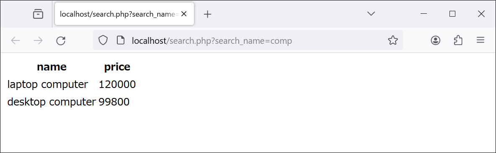
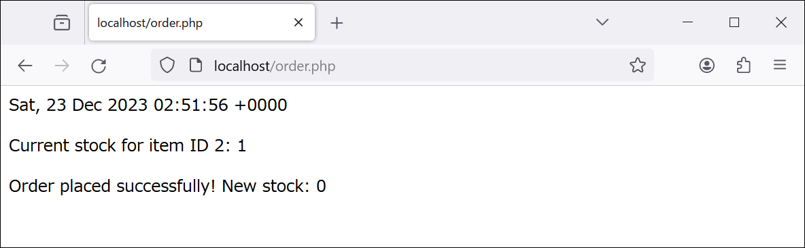
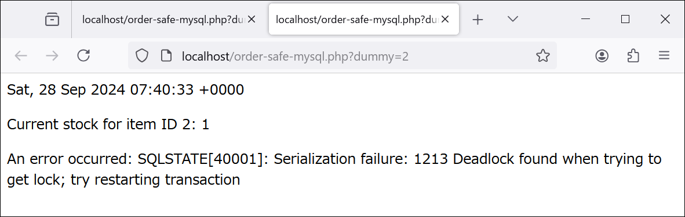
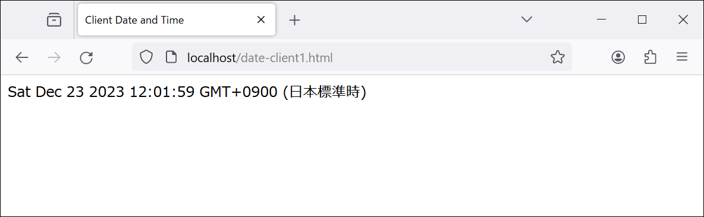
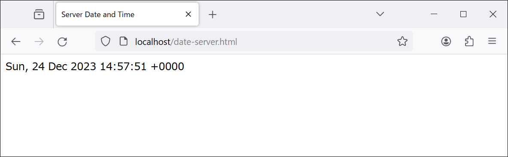
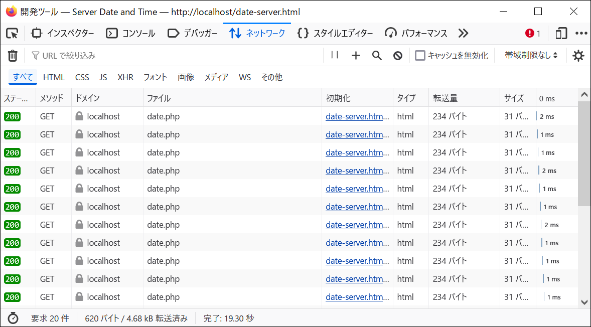

[← 第7章 Webアプリケーションの基礎](07.md)　[第9章 Webアプリケーションのセキュリティ →](09.md)

# Webアプリケーションの構築

> [!WARNING]
> ここで紹介する例は，概念を説明するための最低限のものである。セキュリティ上の問題（脆弱性）が存在するため，公開された環境でそのまま使うべきではない。また，HTMLは最低限の要素だけを使う場合がある。HTMLの全体を構文エラーの無いものにすることにはこだわらない。

## データベース

> [!NOTE]
> RDBMS（SQLiteとMySQL）をインストールして，Apacheを再起動，MySQLの一般クエリログを有効にして，mysqlユーザのホームディレクトリを/var/lib/mysqlに変更（必須ではない）して，MySQLを起動する。

```bash
apt-get install -y mysql-server php-mysql php-sqlite3 sqlite3
apachectl restart

cat <<EOF >>/etc/mysql/mysql.cnf
[mysqld]
general_log = 1
general_log_file = /var/log/mysql/general.log
EOF

usermod -d /var/lib/mysql mysql

service mysql start
```

### データの操作

> [!IMPORTANT]
> SQLの基本を紹介する。RDBMSはSQLiteとMySQLを使う。ログの確認とトランザクションレベルの設定はMySQLでのみ行う。

> [!NOTE]
> 以下で実行するSQL（`SELECT * FROM items;`まで）は[mydb.sql](mydb.sql)にまとめてある。次のようにして，まとめて実行できる。

```bash
# 「SELECT * FROM items;」までを，まとめて実行する場合
# SQLite
mkdir /var/data
sqlite3 /var/data/mydb.db < /var/www/techappweb/07-09/mydb.sql
chown www-data:www-data /var/data /var/data/mydb.db

# MySQL
mysql -uroot < /var/www/techappweb/07-09/mydb.sql
```

次のようなテーブルを作成する。

id|name|price|stock
--|--|--|--
1|laptop computer|120000|2
2|desktop computer|99800|0
3|display|30350|100
4|keyboard|2980|10

#### SQLiteの準備

データベースのためのファイルを格納するフォルダを作り，SQLiteに接続する。

```bash
mkdir /var/data
sqlite3 /var/data/mydb.db
```

#### MySQLの準備

`mysql -uroot`でMySQLに接続し，データベースとユーザ（ユーザ名：`testuser`，パスワード：`pass`）を作成する。

```sql
DROP DATABASE IF EXISTS mydb;                             -- データベースの削除
CREATE DATABASE mydb;                                     -- データベースの作成
DROP USER IF EXISTS 'testuser'@'localhost';               -- ユーザの削除
CREATE USER 'testuser'@'localhost' IDENTIFIED BY 'pass';  -- ユーザの作成
GRANT ALL PRIVILEGES ON mydb.* TO 'testuser'@'localhost'; -- 権限の付与
FLUSH PRIVILEGES;                                         -- 権限の反映
USE mydb;                                                 -- データベースの選択
```

#### テーブルの作成

SQLiteまたはMySQLのプロンプトで実行する。

```sql
DROP TABLE IF EXISTS items;
CREATE TABLE items (
  id INTEGER PRIMARY KEY /*! AUTO_INCREMENT */,
  name TEXT,
  price INTEGER,
  stock INTEGER
);
```

#### CRUD

**Create**の例として，表のデータを生成する。

```sql
INSERT INTO items (name, price, stock) VALUES
('laptop computer', 120000, 2),
('desktop computer', 99800, 0),
('display', 30350, 100),
('keyboard', 2980, 10);
```

**Read**の例として，テーブルitemsから，在庫数が1より多い商品の，idとnameを取得する。

```sql
SELECT id,name FROM items WHERE stock>1;
```

**Update**の例として，テーブルitemsの，id=2であるデータの，stockを1にする。

```sql
UPDATE items SET stock=1 WHERE id=2;
```

**Delete**の例として，テーブルitemsの，id=4であるデータを削除する。

```sql
DELETE FROM items WHERE id=4;
```

以上の操作をすべて行うと，テーブルitemsは次のようになる。

id|name|price|stock
--|--|--|--
1|laptop computer|120000|2
2|desktop computer|99800|1
3|display|30350|100

この結果を確認する。

```sql
SELECT * FROM items;
```

> [!NOTE]
> SQLiteまたはMySQLのプロンプトをCtrl-Dで終了する。

SQLiteのデータベースにWebサーバがアクセスできるようにする。

```bash
chown www-data:www-data /var/data /var/data/mydb.db
```

### Webアプリケーションでのデータベース利用

> [!IMPORTANT]
> 指定した文字列を商品名に含むものを検索する。

次のファイルで実現する。

- [SQLiteで検索: search-sqlite.php](html/search-sqlite.php)
    - [SQLiteに接続: db-sqlite.php](html/db-sqlite.php)
- [MySQLで検索: search-mysql.php](html/search-mysql.php)
    - [MySQLに接続: db-mysql.php](html/db-mysql.php)
- [共通部分: search.php](html/search.php)

> [!CAUTION]
> search.phpにはSQLインジェクションの脆弱性がある。それについては，[第9章](09.md)で説明する。

次のURLで動作を確認する。

- SQLite: http://localhost/search-sqlite.php?search_name=comp
- MySQL: http://localhost/search-mysql.php?search_name=comp

MySQLを使った場合の結果を示す。



### トランザクション

#### 失敗例

> [!IMPORTANT]
> 在庫数が1個の商品を，二人の顧客が同時に購入しようとする。

次のファイルで実現する。

- [SQLiteを更新: order-sqlite.php](html/order-sqlite.php)
- [MySQLを更新: order-mysql.php](html/order-mysql.php)
- [共通部分: order.php](html/order.php)

次の手順で購入をシミュレートする。

1. idが2の商品の在庫数を1にする。

```bash
# SQLite
sqlite3 /var/data/mydb.db 'update items set stock=1 where id=2'

# MySQL
mysql -uroot mydb -e 'update items set stock=1 where id=2'
```

2. 購買処理を行う。

> [!TIP]
> Ctrl-クリックで二つのタブを開いて，同時にアクセスする。二つのタブで別々の接続を使うように，クエリを付加している（これがないと，Chromeでは二つの処理が並列でなくなる）。

- SQLite
    1. http://localhost/order-sqlite.php?dummy=1 （1人目）
    2. http://localhost/order-sqlite.php?dummy=2 （2人目）
- MySQL
    1. http://localhost/order-mysql.php?dummy=1 （1人目）
    2. http://localhost/order-mysql.php?dummy=2 （2人目）

結果として、在庫数が1にもかかわらず，2人の購買処理は正常終了してしまう。MySQLを更新する場合の、2人目の結果を示す。



#### 成功例

> [!IMPORTANT]
> トランザクションを使うと，2人目の購買処理は失敗する。

次のファイルで実現する。

- [SQLiteを更新: order-safe-sqlite.php](html/order-safe-sqlite.php)（SQLite独自の変更はない。）
- [MySQLを更新: order-safe-mysql.php](html/order-safe-mysql.php)（トランザクション分離レベルをデフォルトから変更する。）
- [共通部分: order-safe.php](html/order-safe.php)

次の手順で購入をシミュレートする。

1. idが2の商品の在庫数を1にする。

```bash
# SQLite
sqlite3 /var/data/mydb.db 'update items set stock=1 where id=2'

# MySQL
mysql -uroot mydb -e 'update items set stock=1 where id=2'
```

2. 購買処理を行う。

- SQLite
    1. http://localhost/order-safe-sqlite.php?dummy=1 （1人目）
    2. http://localhost/order-safe-sqlite.php?dummy=2 （2人目）
- MySQL
    1. http://localhost/order-safe-mysql.php?dummy=1 （1人目）
    2. http://localhost/order-safe-mysql.php?dummy=2 （2人目）

2人の購買処理のうち，後に行ったものがエラーになる。MySQLを更新する場合の、2人目の結果を示す。



## クライアントサイドの技術

### JavaScriptによる時刻の表示

> [!IMPORTANT]
> クライアントサイドの日時を表示する。

http://localhost/date-client1.html にアクセスすると，次のように現在の日時が表示される。



> [!NOTE]
> 表示を更新するためにはページの再読込が必要である。

[実装（date-client1.html）](html/date-client1.html)の一部を示す。

```javascript
<div id="result"></div>
<script>
  const result = document.getElementById('result');      // 要素の取得
  const currentDateTime = new Date();                    // 現在の日時の取得
  result.textContent = currentDateTime.toLocaleString(); // 内容の更新
</script>
```		

### JavaScriptによる時刻の表示（自動更新）

> [!IMPORTANT]
> クライアントサイドの日時を表示する。（自動更新）

http://localhost/date-client2.html にアクセスすると，現在の日時が表示され，1秒ごとに更新される。

> [!NOTE]
> 表示を更新するのにページの再読込は必要ない。ページ自体は再読込されず，内容だけが更新される。

[実装（date-client2.html）](html/date-client2.html)の一部を示す。

```javascript
<div id="result"></div>
<script>
  const result = document.getElementById('result'); // 要素の取得

  const updateDateTime = () => { // 日時を更新する関数
    const currentDateTime = new Date();
    result.textContent = currentDateTime.toLocaleString();
  };

  setInterval(updateDateTime, 1000); // 1秒ごとにupdateDateTimeを呼び出す。
</script>
```

### JavaScriptの通信による時刻の取得（自動更新）

> [!IMPORTANT]
> サーバサイドの日時を表示する。（自動更新）

http://localhost/date-server.html にアクセスすると，現在の日時が表示され，1秒ごとに更新される。



[実装（date-server.html）](html/date-server.html)の一部を示す。

```javascript
<div id="result"></div>
<script>
  const result = document.getElementById('result'); // 要素の取得

  const updateDateTime = async () => { // 日時を更新する関数
    const response = await fetch('http://localhost/date.php');
    const data = await response.text();
    result.textContent = data;
  };

  setInterval(updateDateTime, 1000); // 1秒ごとにupdateDateTimeを呼び出す。
</script>
```

> [!TIP]
> Webサーバとの通信の様子は，Firefoxの**ウェブ開発ツール**，Chromeの**デベロッパーツール**等で確認できる。



> [!CAUTION]
> http://localhost/date-server.html の代わりにhttp://127.0.0.1/date-server.html とすると動作しない。アクセスするサーバの実体は同じだがオリジンが異なり，JavaScirptでの通信がSOP（Same-Origin Policy）に反するからである。例外を許可するための`header("Access-Control-Allow-Origin: http://127.0.0.1");`を追記した[date-sop.php](html/date-sop.php)を使えば，動作する。http://127.0.0.1/date-server-sop.html で確認できる。

[← 第7章 Webアプリケーションの基礎](07.md)　[第9章 Webアプリケーションのセキュリティ →](09.md)
