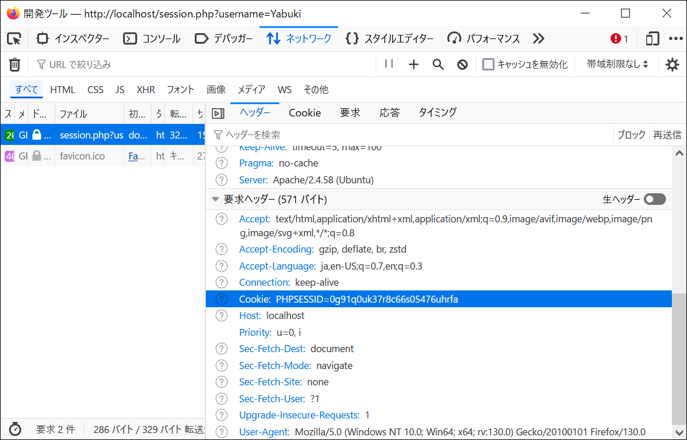
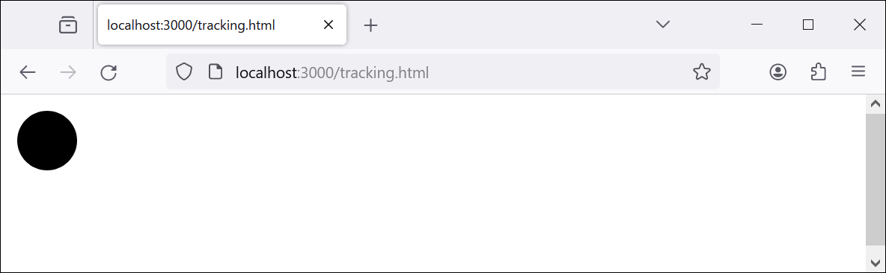
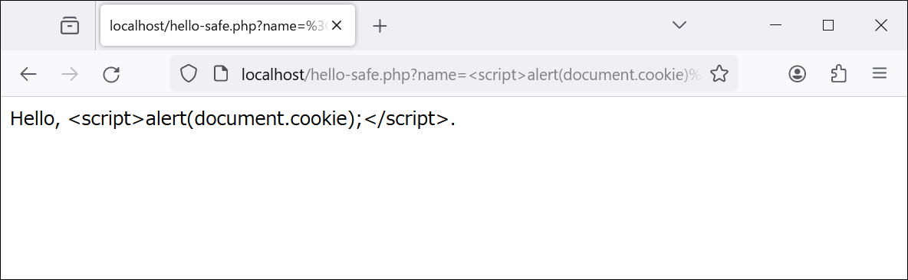

[← 第8章 Webアプリケーションの構築](08.md)

# Webアプリケーションのセキュリティ

## 前提知識

### アカウント

#### セッションとクッキー

[第7章](07.md)で構築した環境で動作するコードを使って説明する。

> [!IMPORTANT]
> 「送信された名前を記憶する」という例を使って，Webサーバがクライアントを識別できることを示す。

1. http://localhost/session.php?username=Taro にアクセスすると，「Hello, Taro.」と表示される。
1. 同じブラウザでhttp://localhost/session.php?username=Yabuki にアクセスすると，「Hello, Yabuki.」と表示される。
1. 同じブラウザでhttp://localhost/session.php にアクセスすると，やはり「Hello, Yabuki.」と表示される。

[session.php](html/session.php)では，1や2のクエリで指定された`username`の値をサーバサイドで記録している。3のように同じブラウザでアクセスすると，その値を使うようにしてある。

Firefoxの**ウェブ開発ツール**，Chromeの**デベロッパーツール**等でネットワークの状況を確認すると，リクエストヘッダに「`Cookie: PHPSESSID=●●●`」という項目があり，リクエスト時にクライアントからサーバにクッキーが送信されていることがわかる（画像では●●●は`0g91q0uk37r8c66s05476uhrfa`）。



このクッキーがあれば，別のクライアントからでも同じセッションにアクセスできる。例えば，次のようにcURLを使ってアクセスすると，「Hello, Yabuki.」と表示される。

```bash
curl 'http://localhost/session.php' -H 'Cookie: PHPSESSID=●●●'
```

> [!TIP]
> 開発ツールやデベロッパーツールには，cURLでアクセスするためのコマンドをクリップボードにコピーする機能があり，これがブラウザの動作をコマンドで再現したい場合に便利である。

#### サードパーティクッキーとトラッキング

> [!IMPORTANT]
> サードパーティクッキーを使って，異なるドメインのウェブサイト間でユーザを追跡する。

サイト|ホスト|コンテンツ
--|--|--
Blog-A|ホストA（127.0.0.1）|[tracking.html](html/tracking.html)
SNS-B|ホストB（localhost）|[session-none.php](html/session-none.php), [good.php](html/good.php)

次のような状況を想定する。

- 運営者の異なる二つのWebサイト，Blog-AとSNS-Bがある。
- ブラウザはサードパーティクッキーを許可している。
- Blog-Aのtracking.htmlには，SNS-Bの画像（good.php）が埋め込まれている。

> [!TIP]
> [good.php](html/good.php)はSVGの画像を生成する。



> [!IMPORTANT]
> SNS-Bのユーザ（Yabuki）の，SNS-Bとは運営者の異なるBlog-Aでの行動が，SNS-Bのログに記録される。

1. SNS-Bのhttp://localhost/session-none.php?username=Yabuki にアクセスして，SNS-Bのクッキーを取得する。
2. Blog-Aのhttp://127.0.0.1/tracking.html に，同じブラウザでアクセスする。
3. 「`tail /var/log/apache2/error.log`」として，SNS-Bのログを確認する，次のような記録が確認できる。

```
[Sat Sep 28 11:07:54.702307 2024] [php:notice] [pid 11847] [client 172.17.0.1:47396] Yabuki, referer: http://127.0.0.1/
```

このSNS-Bのログから，SNS-Bの管理者は，このSNSのユーザYabukiがBlog-Aにアクセスしたことがわかる。

## Webアプリケーションの典型的な脆弱性

> [!CAUTION]
> ここで紹介する例は，自分で用意した実験用の環境でのみ試すべきである。

### XSS

> [!IMPORTANT]
> 第三者のスクリプトが実行できる状態のページの悪用例を示す。

1. 被害者がhttp://localhost/session.php?username=Yabuki にアクセスして，クッキーを取得する。
1. 被害者が，同じブラウザでhttp://localhost/hello.php?username=%3Cscript%3Ealert%28document.cookie%29%3B%3C%2Fscript%3E にアクセスすると，このページに埋め込まれたスクリプト（JavaScriptのコード）によって，クッキーが盗まれる。この例のURLは`http://localhost/hello.php?username=<script>alert(document.cookie);</script>`をパーセントエンコーディングしたものである（これはクッキーを表示するだけのものだが，[第8章](08.md)の方法で通信を行うことで，クッキーを盗める）。


この問題は，[hello.php](html/hello.html)の代わりに[hello-safe.php](html/hello-safe.php)を使うと解決される。被害者がhttp://localhost/hello-safe.php?name=%3Cscript%3Ealert%28document.cookie%29%3B%3C%2Fscript%3E にアクセスしても，クッキーは盗まれない。



### セッション固定化攻撃

1. 攻撃者が，「`curl -I http://localhost/session.php?username=XYZ`」でセッションを用意する（オプション「`-I`」でレスポンスヘッダを表示する。

```
# curl -I http://localhost/session.php?username=XYZ
HTTP/1.1 200 OK
Date: Fri, 27 Sep 2024 08:07:56 GMT
Server: Apache/2.4.58 (Ubuntu)
Set-Cookie: PHPSESSID=m3vkgshugnjgqicqaklh4iiphd; path=/
Expires: Thu, 19 Nov 1981 08:52:00 GMT
Cache-Control: no-store, no-cache, must-revalidate
Pragma: no-cache
Content-Type: text/html; charset=UTF-8
```

2. PHPSESSIDを●●●とする。上の例では●●●は`m3vkgshugnjgqicqaklh4iiphd`である。
2. 被害者をhttp://localhost/hello.php?username=%3Cscript%3Edocument.cookie%3D%27PHPSESSID%3D●●●%27%3B%3C%2Fscript%3E にアクセスさせる。このURLは`http://localhost/hello.php?username=<script>document.cookie='PHPSESSID=●●●';</script>`をパーセントエンコーディングしたものである。（この段階では何も起こらない。）
3. 被害者がそのサイト上でhttp://localhost/session.php?username=Yabuki などの活動をする。この活動は，攻撃者が用意したセッションで行われる。
4. 攻撃者もそのセッションにアクセスすることで，被害者の活動を知ることができる。

```bash
# curl http://localhost/session.php -H 'Cookie: PHPSESSID=●●●'
Hello, Yabuki.
```

> [!TIP]
> この作業をサポートするスクリプトを用意している。次のようにcreate-session.shをシェルで実行して，1行目の2行目のURLをブラウザで開き，3行目をシェルで実行する。

```bash
# sh /var/www/techappweb/07-09/create-session.sh
http://localhost/hello.php?username=%3Cscript%3Edocument.cookie%3D'PHPSESSID%3Dcqr1vj3gsd18kqguvpbh12ac5s'%3B%3C%2Fscript%3E
http://localhost/session.php?username=Yabuki
curl http://localhost/session.php -H 'Cookie: PHPSESSID=cqr1vj3gsd18kqguvpbh12ac5s'

# 二つのURLにブラウザでアクセスしてから，3行目を実行する。
# curl http://localhost/session.php -H 'Cookie: PHPSESSID=cqr1vj3gsd18kqguvpbh12ac5s'
Hello, Yabuki.
```

この問題は，[session.php](html/session.php)の代わりに[session-safe.php](html/session-safe.php)を使うと解決される。被害者がhttp://localhost/session-safe.php?username=Alice などの活動をすると，攻撃者が用意したセッションは使えなくなり，上記のように`curl ...`としても，何も得られない。

### CSRF

> [!IMPORTANT]
> Blog-Aのページをを閲覧すると，Blog-Aとは無関係なSNS-Bを操作することになる。

サイト|ホスト|コンテンツ
--|--|--
Blog-A|ホストA（127.0.0.1）|[csrf.html](html/csrf.html)
SNS-B|ホストB（localhost）|[session-none.php](html/session-none.php), [rename.php](html/rename.php)

次のような状況を想定する。

- 運営者の異なる二つのWebサイト，Blog-AとSNS-Bがある。
- ブラウザはサードパーティクッキーを許可している。

1. 被害者が，SNS-Bのhttp://localhost/session-none.php?username=Yabuki にアクセスして，SNS-Bのクッキーを取得する。
2. 被害者が，Blog-Aのhttp://127.0.0.1/csrf.html に，同じブラウザでアクセスすると，rename.php（ユーザ名に`*`を追加）が実行されてしまう。
3. 被害者が，SNS-Bのhttp://localhost/session.php に，同じブラウザでアクセスすると，「Hello, Yabuki.」ではなく，「Hello, Yabuki*.」と表示される。

### SQLインジェクション

（第8章で作成した）次のファイルにはSQLインジェクション脆弱性がある。

- [SQLite: search-sqlite.php](html/search-sqlite.php)
- [MySQL: search-mysql.php](html/search-mysql.php)
- [共通部分: search.php](html/search.php)（脆弱な実装）

全ての商品が取得される。これはアプリの作成者が意図した動作ではない。

- SQLite: http://localhost/search-sqlite.php?search_name=%27+OR+TRUE+%2D%2D+
- MySQL: http://localhost/search-mysql.php?search_name=%27+OR+TRUE+%2D%2D+

SQLインジェクション脆弱性を修正した実装は次の通り。

- [SQLite: search-safe-sqlite.php](html/search-safe-sqlite.php)（SQLite独自の変更はない。）
- [MySQL: search-safe-mysql.php](html/search-safe-mysql.php)（プリペアドステートメントをMySQLで処理する。）
- [共通部分: search-safe.php](html/search-safe.php)（プリペアドステートメントを使用する。）

「全ての商品が取得される」ということはない。

- SQLite: http://localhost/search-safe-sqlite.php?search_name=%27+OR+TRUE+%2D%2D+
- MySQL: http://localhost/search-safe-mysql.php?search_name=%27+OR+TRUE+%2D%2D+

シェルで`tail /var/log/mysql/general.log`を実行して，MySQLにおけるプリペアドステートメントの処理を確認する。

```
# tail /var/log/mysql/general.log
# ...
2024-09-26T08:06:54.301423Z        24 Connect   testuser@localhost on mydb using TCP/IP
2024-09-26T08:06:54.302708Z        24 Prepare   SELECT * FROM items WHERE name LIKE ?
2024-09-26T08:06:54.302762Z        24 Execute   SELECT * FROM items WHERE name LIKE '%\' OR TRUE -- %'
2024-09-26T08:06:54.302960Z        24 Close stmt
2024-09-26T08:06:54.302973Z        24 Quit
```

[← 第8章 Webアプリケーションの構築](08.md)
